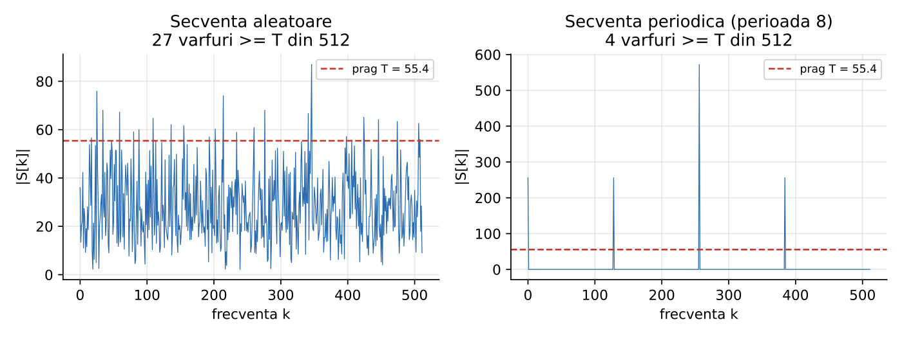
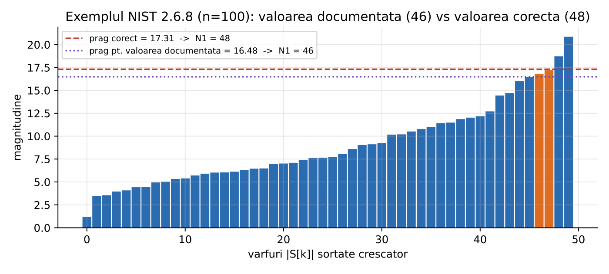
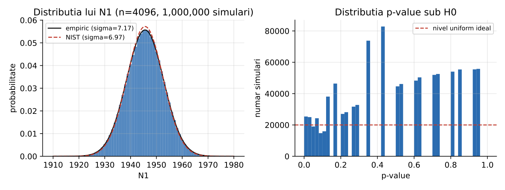
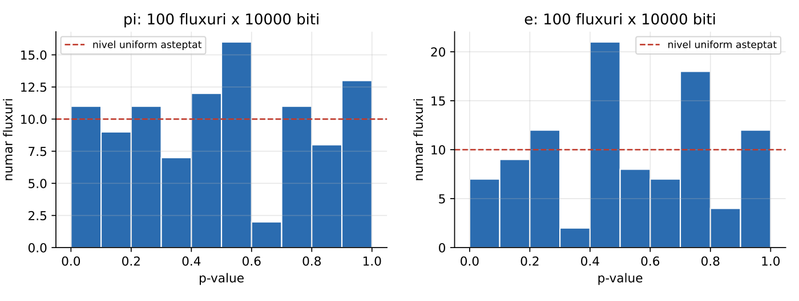

# NIST SP 800-22 Randomness Test Suite

A from-scratch C++17 implementation of the NIST SP 800-22 statistical test suite
for (pseudo)random number generators, with the Discrete Fourier Transform (spectral)
test, section 2.6, studied in depth: its mathematics, a reference-faithful
implementation, Monte-Carlo simulations under the null hypothesis, and the
well-documented controversy around the test in the academic literature.

**Live demo:** https://prng-nist-tests.student-dev.ro
(interactive test runner, sequence explorer, and a public JSON API)

## Highlights

- **All 15 NIST tests implemented** and validated against the published worked
  examples, behind one test-agnostic architecture: a test registry, a generic
  runner, and a shared second-level (proportion + uniformity) assessment that work
  over any test.
- **Found and documented an error in the official NIST standard.** For the 100-bit
  example in section 2.6.8 the document prints `N1 = 46, p = 0.168669`. The correct
  result is `N1 = 48, p = 0.646355`, verified three independent ways: this project's
  own FFT, the original NIST reference FFT (`__ogg_fdrfftf`) compiled and run
  separately, and NumPy. The documentation contradicts its own reference code.
- **Scales to realistic inputs.** A custom FFT (radix-2 plus Bluestein's algorithm
  for arbitrary lengths) runs the test on 1,000,000 bits in about 0.43 s, instead of
  the O(n^2) textbook DFT.
- **Full stack.** A C++ core library and two CLIs, a Next.js 15 web app with a
  public JSON API whose endpoints spawn the real C++ binary, and an academic paper.
- **Tested three ways.** C++ unit and compliance tests (doctest), web route and
  validation tests (Vitest), and an independent Python statistical cross-check
  (NumPy / SciPy).

## Tech stack

C++17, CMake + Ninja, Next.js 15 / React 19 / TypeScript, Tailwind v4, Plotly,
Docker, Nginx.

## What the spectral test does

A truly random bit sequence has an approximately flat power spectrum (white noise):
no frequency dominates. A periodic component concentrates energy at specific
frequencies, producing tall spectral peaks. The test moves the sequence into the
frequency domain via a DFT, counts how many spectral peaks exceed a 95% threshold,
and compares that count to the value expected under randomness. The verdict is given
by a critical-value comparison (the statistic against `z_{1-alpha/2}` for normal
tests or `chi^2_{alpha,df}` for chi-square tests), with the p-value kept as
secondary information.

## Figures

The figures below are from the paper and the site's `/figures` page (axis labels
are in Romanian, shared with the paper).

**Random vs periodic input.**

A random sequence gives a roughly flat spectrum with about 5% of peaks above the
95% threshold, exactly as the null hypothesis predicts. A period-8 sequence
concentrates its energy into a few tall harmonics.

**The standard's error, visualized.**

The 50 sorted spectral magnitudes of the section 2.6.8 example. The correct
threshold (17.31) gives `N1 = 48`; reproducing the document's printed `N1 = 46`
would need a threshold about 5% lower (16.48), excluding the two borderline peaks
shown in orange.

**One million Monte-Carlo runs under H0.**

Left: the empirical distribution of `N1` over 10^6 random sequences, against the
theoretical Gaussians using the empirical and the NIST standard deviation. Right:
the resulting p-value distribution. The slight spread quantifies the test's known
variance inflation relative to the NIST normalization.

**p-value uniformity on real data.**

Per-stream p-value histograms for the binary expansions of pi (uniform) and e
(slightly non-uniform) across 100 streams.

## Layout

```
src/      C++17 library (libdft) + 2 CLIs
            test.hpp / test_registry  RandomnessTest interface + id -> test registry
            nist_runner               generic runner: options in, JSON/text out
            fft / bit_sequence / special / engine_factory / verdict   shared core
            spectral_test             the DFT / spectral test (sec 2.6), in depth
            <15 tests>_test.cpp        the full SP 800-22 suite
            assessment                second-level proportion + uniformity
            nist_main / nist_assess_main  ->  nist_test / nist_assess
tests/    doctest unit + NIST-compliance suite, Python validation, run_all scripts
data/     NIST data files (binary expansions of e, pi, sqrt2, sqrt3; a SHA-1 PRNG)
web/      Next.js 15 app (UI + public JSON API) + Dockerfile + Nginx config
docs/     engineering notes (Romanian): architecture, API, testing, adding a test
papers/   CLAIMS.md (every paper claim mapped to its source) + bibliography index
reference/  the original NIST reference DFT driver (used for the N1 = 48 cross-check)
Testul-Spectral-DFT-NIST-SP-800-22.pdf   the academic paper (Romanian, 5 chapters)
```

## Build

Requires a C++17 compiler, CMake and Ninja.

```bash
cmake -S . -B build -G Ninja -DCMAKE_BUILD_TYPE=Release
cmake --build build
```

Or the whole chain (build + tests + run on the NIST data) via `tests/run_all.ps1`
(PowerShell) or `tests/run_all.sh` (bash).

## Run

Single sequence, any test in the suite (default is `dft`):

```bash
./build/nist_test -t dft   data/bits_nist_example.txt    # -> N1=48, p=0.646355
./build/nist_test -t monobit --json data/data.e
```

Multi-stream assessment (proportion + uniformity, NIST-style):

```bash
./build/nist_assess -t dft data/data.e data/data.pi data/data.sqrt2 data/data.sqrt3 data/data.sha1
```

CLI options: `-t|--test <id>`, `-a|--alpha <val>`, `-b|--block <N>` (block tests),
`-m|--method auto|fft|direct` (dft only), `--json`, `--spectrum` (dft). `--help`
lists the registered tests.

## Web app and public API

A Next.js 15 (App Router) app whose API routes spawn the real C++ binaries on the
server. Live at https://prng-nist-tests.student-dev.ro; the API is documented at
[`/api-docs`](https://prng-nist-tests.student-dev.ro/api-docs).

```bash
cd web && pnpm install && pnpm dev    # local -> http://localhost:3000
cd web && pnpm gen                    # regenerate static data from the binaries
cd web && pnpm test                   # Vitest (API routes via the real binary, validation, rate limit)
```

Main endpoint: `POST /api/run/{test}` with `{ "bits": "1100..." }`, returning a
uniform JSON envelope (`p_value`, `passed`, `statistic`, `critical`, per-test stats,
and for `dft` the sampled spectrum).

## Tests

- **C++ (doctest):** FFT vs direct DFT agreement, test mechanics, NIST compliance
  (the section 2.6.8 example = `N1 = 48`), and the supporting modules.
- **Web (Vitest):** API routes through the real binary, input validation, rate limit.
- **Python (NumPy / SciPy):** known-answer cases, a Monte-Carlo check that the
  false-positive rate is near alpha, and a cross-check against the reference driver.

## The paper

The accompanying academic paper (Romanian, 5 chapters) ships as
`Testul-Spectral-DFT-NIST-SP-800-22.pdf` at the repository root. It covers the
test's mathematics, the implementation, Monte-Carlo experiments under the null
hypothesis, and the literature controversy (Kim et al. 2004, Hamano 2005,
Pareschi et al. 2012, Iwasaki and Umeno). The same content is also browsable on the
live site under `/paper`.

## Context

University project for a cryptography course (master's, year 1, semester 2).
Team: Wagner Stefan-Daniel, Oltean Dan-Gabriel, Matveev Victor-Nicolae,
Puflea Steluta Lavinia. Coordinator: conf. univ. dr. Emil Simion.
